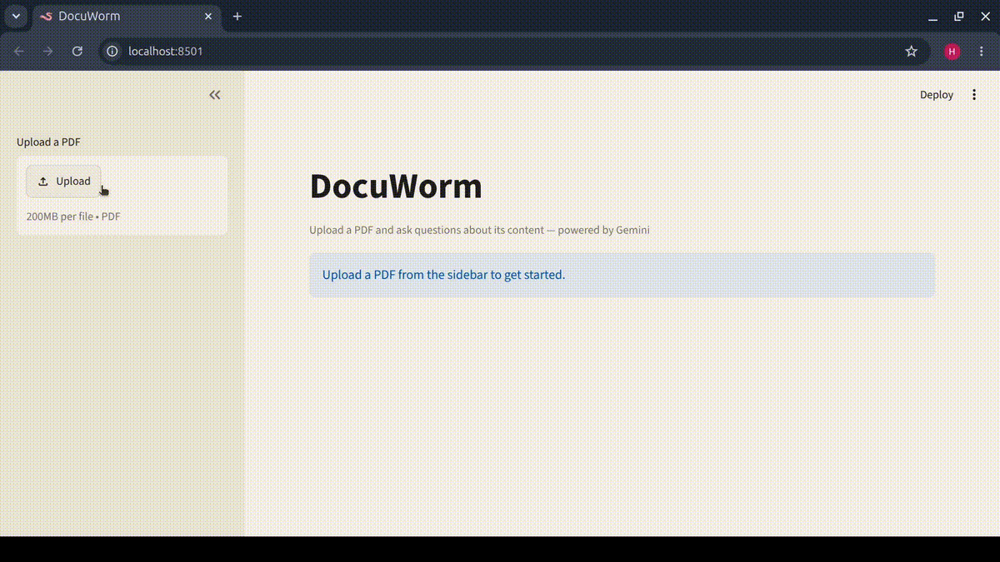

# 🐛 DocuWorm

**Upload a PDF. Ask anything. DocuWorm reads so you don't have to.**



## What it does

DocuWorm lets you upload any PDF document and chat with it in natural language. It extracts the full text, sends your question alongside the document to Gemini, and returns a grounded answer — if the answer isn't in the PDF, it says so.

## Tech stack

| Layer | Tool |
|---|---|
| UI | [Streamlit](https://streamlit.io/) |
| PDF extraction | [PyMuPDF](https://pymupdf.readthedocs.io/) |
| LLM | Google Gemini (`gemini-2.5-flash`) via [google-genai](https://ai.google.dev/gemini-api/docs/sdks) |
| Data models | [Pydantic](https://docs.pydantic.dev/) |
| Package manager | [uv](https://docs.astral.sh/uv/) |

## Getting started

### Prerequisites

- Python ≥ 3.14
- [uv](https://docs.astral.sh/uv/#installation) installed
- A [Google Gemini API key](https://aistudio.google.com/apikey)

### Setup

1. **Clone the repo**

   ```bash
   git clone https://github.com/horel19/docuworm.git
   cd docuworm
   ```

2. **Create the environment and install dependencies**

   ```bash
   uv sync
   ```

3. **Add your API key**

   ```bash
   cp .env.example .env
   # Edit .env and replace the placeholder with your real key
   ```

4. **Run the app**

   ```bash
   uv run streamlit run src/pdf_chatbot/ui.py
   ```

Open the local URL shown in your terminal (usually <http://localhost:8501>), upload a PDF, and start asking questions.

## Project structure

```
docuworm/
├── .streamlit/
│   └── config.toml          # Streamlit theme and server config
├── .env.example              # API key template
├── pyproject.toml            # Dependencies and tooling config
├── src/
│   └── pdf_chatbot/
│       ├── __init__.py
│       ├── chat.py           # Gemini API interaction
│       ├── ingestor.py       # PDF text extraction (PyMuPDF)
│       ├── ui.py             # Streamlit interface
│       └── validators.py     # Pydantic models (ChatMessage, ChatSession)
└── assets/
    └── demo.gif              # Demo recording
```
